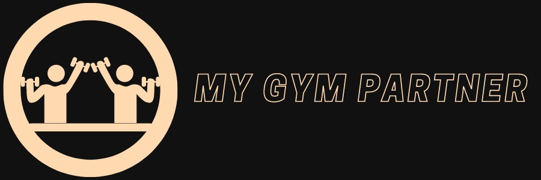
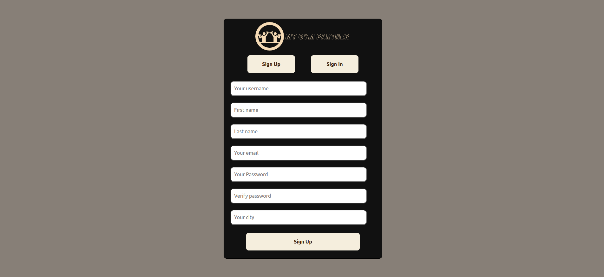
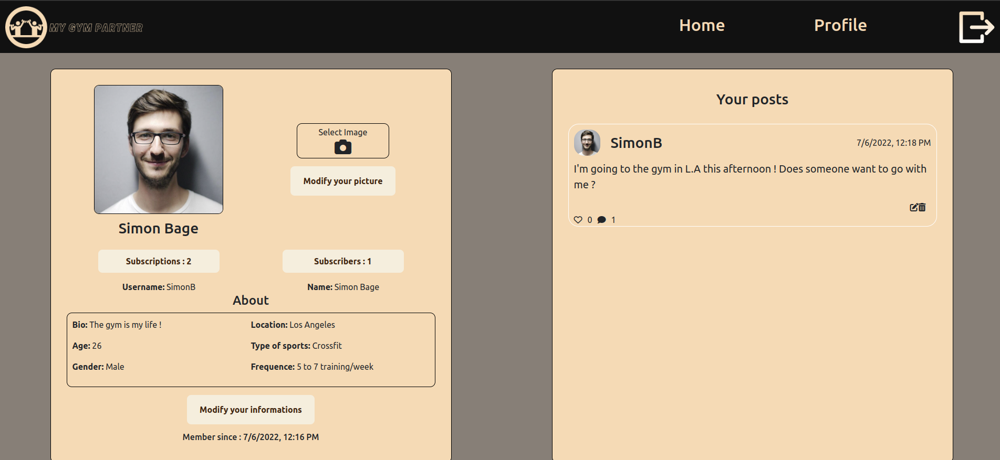
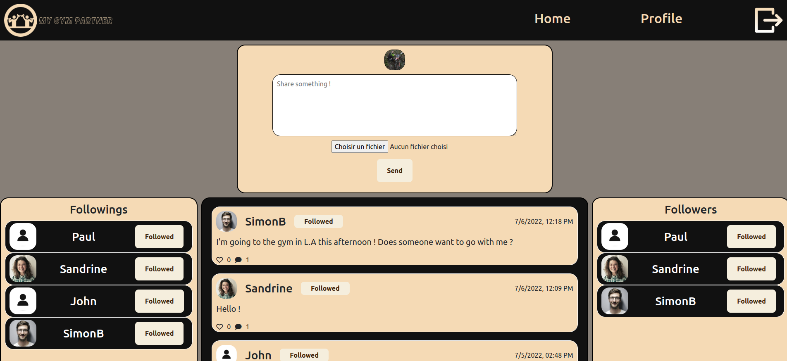

# <div align="center">Project Portfolio</div>

<p align="center"></p>

## Introduction

Hello everyone ! My name is Maxence Potier, I have 22 years old and I am a studient at Holberton School Paris. This is the last project of my first year and I hope you will like it.

This project is a social network to help to find your gym partner. I have this idea because i go to the gym almost everyday but sometimes i don't have motivation and I would like to have someone to train with. I'm sure I'm not the only one in this case so I decided to develop a social network to answer this problem.

I decided to develop this project with a MERN Architecture. For more information on the developpement of the project I recommend you to write my article : [link](https://www.linkedin.com/pulse/my-portfolio-project-maxence-potier)

## Installation 

For the installation you have to install all the needed packages :

Install all the back-end librairies : ```npm i``` </br>
Install all the front-end libraires : ```cd client``` + ```npm i```

### Back config

Create a cluster with MongoDB Atlas and then configure the file ```./config/db.js```
Create a file ```.env``` in the folder ```config``` and config the variables :
 - PORT = ```Port for back-end```
 - URL_CLIENT = ```URL of your front-end```
 - DB_USER_PASS = ```user and password of db```
 - TOKEN_KEY = ```token key```

### Front config

Create a file ```.env``` in the folder ```client``` and config the variables :
- REACT_APP_API_URL = ```URL of your API```

## Usage 

Now you can run the server : ```npm start```
And run the front : ```cd client``` + ```npm start```

## Result

You can sign in or sign up :
<p align="center">

</p>

Also you can see your profile with your informations, edit them and see your posts :
<p align="center">

</p>

And you can post, follow someone, see posts, comments, like :
<p align="center">

</p>

## Contribution 

Me : [Maxence Potier](https://github.com/Mxn-ptr)

## Related Projects

[AirBnB](https://github.com/Mxn-ptr/AirBnB_clone_v4) </br>
[Simple Shell](https://github.com/Mxn-ptr/simple_shell) </br>

## License

This project is not for open-source.


